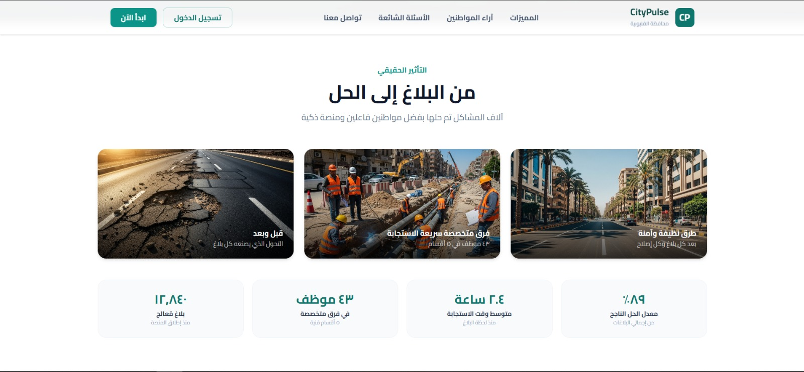
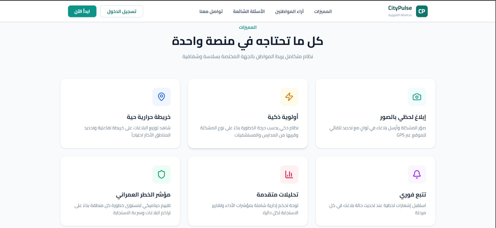
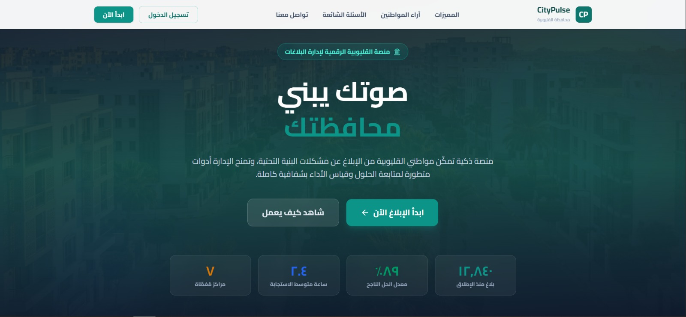
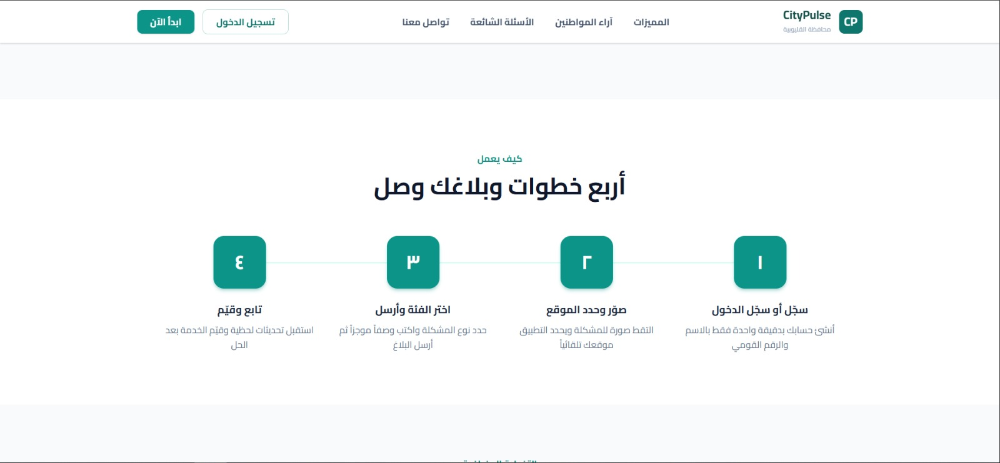
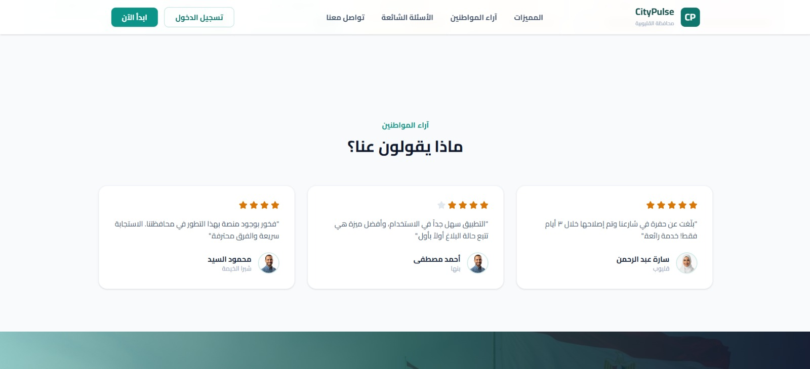
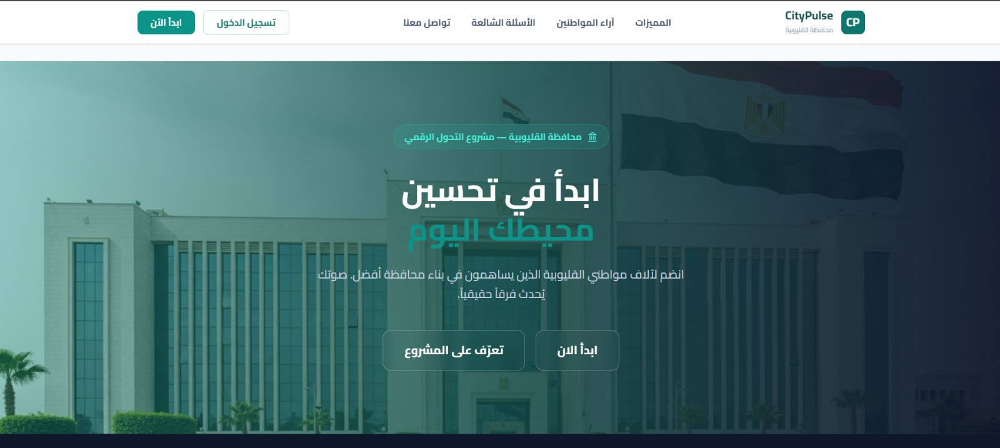
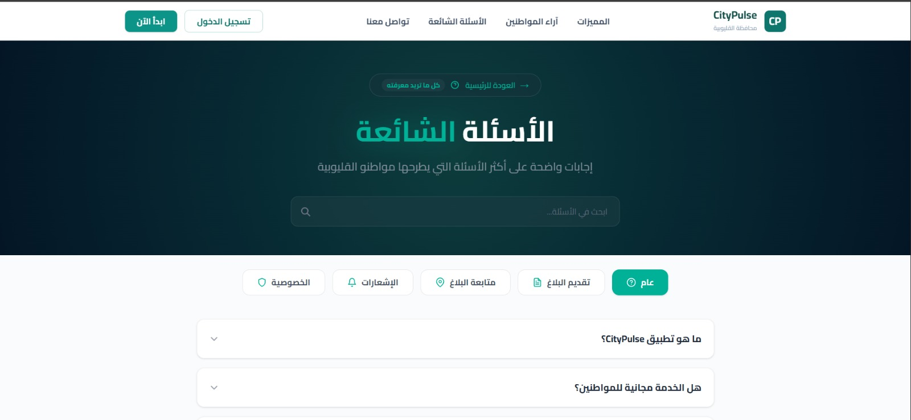
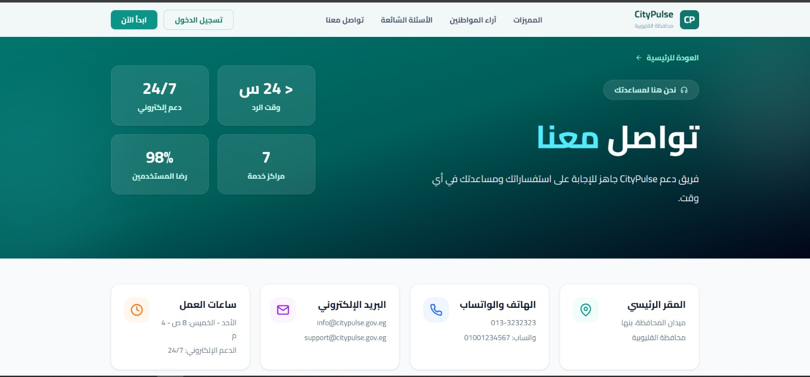
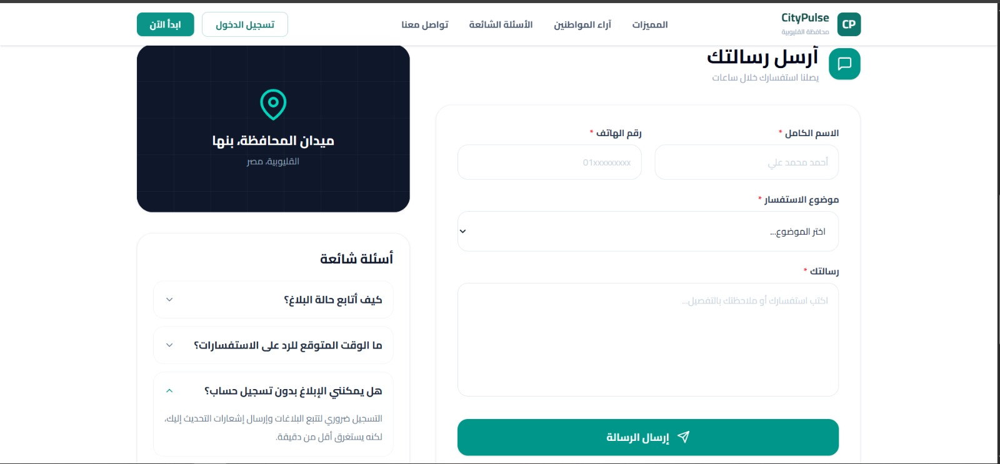
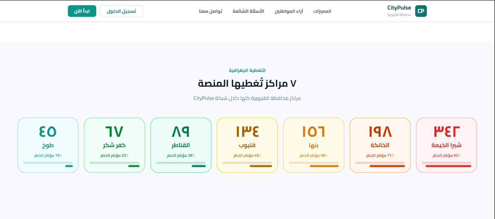

# CityPulse (نبض المدينة) 🏙️

نظام إلكتروني لإدارة والإبلاغ عن المشاكل والأعطال داخل المدن، مخصص لمحافظة **القليوبية** بجمهورية مصر العربية.

يتيح النظام للمواطنين الإبلاغ عن مشاكل البنية التحتية (طرق، مياه، كهرباء، نظافة... إلخ) بسهولة عبر تحديد الموقع على الخريطة ورفع الصور، بينما يوفر للإدارة أدوات متقدمة للمتابعة والتحليل واتخاذ القرار (Dashboard، خرائط حرارية، تجميع البلاغات المتشابهة، وحساب مؤشر الخطورة لكل منطقة).

---

## 📌 نظرة عامة

| | |
|---|---|
| **النوع** | نظام إبلاغ وإدارة مشاكل بلدية (Municipal Issue Reporting & Management System) |
| **المحافظة** | القليوبية |
| **الـ Stack** | MERN (MongoDB, Express, React, Node.js) |
| **اللغة** | العربية (RTL) |

---

## ✨ أبرز المميزات

### 👤 للمواطنين
- الإبلاغ عن المشاكل (طرق، مياه، كهرباء، نظافة، بنية تحتية، أخرى) مع إرفاق حتى 5 صور (Cloudinary).
- تحديد الموقع بدقة على خريطة تفاعلية (Leaflet/OpenStreetMap) مع كشف تلقائي للحي (District) من الإحداثيات.
- متابعة حالة البلاغ بدون تسجيل دخول عبر رقم البلاغ.
- لوحة تحكم شخصية بإحصائيات البلاغات، وتقييم البلاغات بعد إغلاقها (1-5 نجوم).
- إدارة الحساب (تعديل البيانات، تغيير كلمة المرور مع تسجيل خروج تلقائي من كل الأجهزة).

### 🛠️ للإدارة (Admin)
- Dashboard إحصائي لحظي (إجمالي البلاغات، المفتوحة، الجارية، المغلقة، نسبة الإنجاز).
- جدول بلاغات متكامل مع فلاتر متقدمة، بحث، Pagination، وتصدير CSV بدعم كامل للعربية (BOM).
- سير عمل لحالة البلاغ: `Open → Assigned → In Progress → Fixed → Closed`.
- خريطة حرارية (Heatmap) لمستوى الخطورة لكل حي مع تلوين وTooltips وفلاتر زمنية.
- نظام تجميع (Clustering) للبلاغات المتشابهة في نفس الفئة وضمن 100 متر، مع إعادة حساب أولوية البلاغ تلقائيًا.
- إدارة المستخدمين (تفعيل/تعطيل الحسابات).

---

## 🧰 التقنيات المستخدمة

**Backend:** Node.js, Express, MongoDB (Mongoose), JWT, bcrypt, Multer + Cloudinary, Helmet, express-mongo-sanitize, express-rate-limit

**Frontend:** React (Vite), Tailwind CSS, React Router v6, Axios, react-leaflet / leaflet, react-icons, @mui/material, @mui/icons-material, recharts (اختياري), date-fns (اختياري)

---

## 🏗️ البنية التقنية (ملخص)

### النماذج (Models)
- **User:** بيانات المستخدم، الدور (user/admin)، حالة التفعيل، تشفير كلمة المرور.
- **Report:** بيانات البلاغ الكاملة (الموقع، الفئة، الصور، الحالة، سجل تغييرات الحالة، درجة الأولوية، التقييم... إلخ).

### الخدمات (Services)
- **Priority Service:** حساب أولوية البلاغ بناءً على الخطورة (40%)، عدد البلاغات المشابهة (20%)، مدة الانتظار (20%)، عوامل الموقع (10%)، التكرار (10%).
- **Clustering Service:** تجميع البلاغات المتقاربة (Haversine formula, حد 100 متر).
- **Risk Index Service:** حساب مؤشر خطورة كل حي.

### الأمان
Helmet, Mongo Sanitize, Rate Limiting (100 req/15min), CORS, bcrypt (12 rounds), JWT مع إبطال تلقائي عند تغيير كلمة المرور.

---

## 📡 أهم الـ API Endpoints

### Auth
| Method | Endpoint | Auth |
|---|---|---|
| POST | `/api/auth/register` | ❌ |
| POST | `/api/auth/login` | ❌ |
| GET | `/api/auth/me` | ✅ |
| PATCH | `/api/auth/update-me` | ✅ |
| PATCH | `/api/auth/update-password` | ✅ |
| POST | `/api/auth/logout` | ✅ |

### Reports (User)
| Method | Endpoint | Auth |
|---|---|---|
| POST | `/api/reports` | ✅ |
| GET | `/api/reports/my-reports` | ✅ |
| GET | `/api/reports/:id` | ✅ |
| DELETE | `/api/reports/:id` | ✅ |
| PATCH | `/api/reports/:id/rate` | ✅ |
| GET | `/api/reports/track/:reportNumber` | ❌ |

### Admin
| Method | Endpoint | Auth |
|---|---|---|
| GET | `/api/admin/dashboard/stats` | Admin |
| GET | `/api/admin/reports` | Admin |
| GET | `/api/admin/reports/:id` | Admin |
| PATCH | `/api/admin/reports/:id/status` | Admin |
| PATCH | `/api/admin/reports/:id/assign` | Admin |
| DELETE | `/api/admin/reports/:id` | Admin |
| GET | `/api/admin/analytics` | Admin |
| GET | `/api/admin/users` | Admin |
| PATCH | `/api/admin/users/:id/status` | Admin |

### Heatmap / Clustering / Risk Index
| Method | Endpoint | Auth |
|---|---|---|
| GET | `/api/heatmap/data` | Admin |
| POST | `/api/clustering/run` | Admin |
| GET | `/api/risk-index` | Admin |
| GET | `/api/risk-index/:district` | Admin |

---

## ⚙️ متغيرات البيئة (Environment Variables)

> ⚠️ عدّل القيم حسب بيئتك الفعلية قبل التشغيل.

```env
# Server
PORT=5000
NODE_ENV=development

# Database
MONGO_URI=mongodb://localhost:27017/citypulse

# JWT
JWT_SECRET=your_jwt_secret
JWT_EXPIRES_IN=7d

# Cloudinary
CLOUDINARY_CLOUD_NAME=your_cloud_name
CLOUDINARY_API_KEY=your_api_key
CLOUDINARY_API_SECRET=your_api_secret

# CORS
CLIENT_URL=http://localhost:5173
```

---

## 🚀 التشغيل محليًا

```bash
# Backend
cd backend
npm install
npm run dev

# Frontend
cd frontend
npm install
npm run dev
```

---

## 📁 هيكل مقترح للمشروع

```
citypulse/
├── backend/
│   ├── models/          # User.js, Report.js
│   ├── controllers/     # auth, report, admin, clustering, heatmap, riskIndex
│   ├── middleware/       # auth, role, upload
│   ├── services/        # priority, clustering, riskIndex
│   ├── utils/           # AppError, priorityScore, validation
│   └── server.js
└── frontend/
    ├── src/
    │   ├── pages/        # public, user, admin
    │   ├── components/   # shared, layout
    │   ├── context/      # AuthProvider
    │   ├── services/     # authAPI, reportAPI, adminAPI
    │   └── App.jsx
    └── vite.config.js
```

---

## 🎨 نظام الألوان

| العنصر | اللون |
|---|---|
| Primary | `#0d9488` |
| Primary Dark | `#0f766e` |
| Primary Light | `#14b8a6` |
| Background | `#F8FAFC` |
| Danger | `#EF4444` |
| Success | `#10B981` |
| Warning | `#F59E0B` |
| Info | `#3B82F6` |

**مستويات الخطورة (Heatmap):** Critical `#DC2626` · High `#D97706` · Medium `#EAB308` · Low `#16A34A` · Safe `#0d9488`

**الخط المستخدم:** Cairo (sans-serif) — دعم كامل لـ RTL.

---

## 🖼️ لقطات من النظام (Screenshots)

| | |
|---|---|
|  |  |
|  |  |
|  |  |
|  |  |
|  |  |


---

## 📄 الترخيص
هذا المشروع مخصص لأغراض الاستخدام الحكومي/التعليمي لمحافظة القليوبية. أضف رخصة مناسبة (MIT, Apache 2.0, إلخ) حسب طبيعة الاستخدام.
